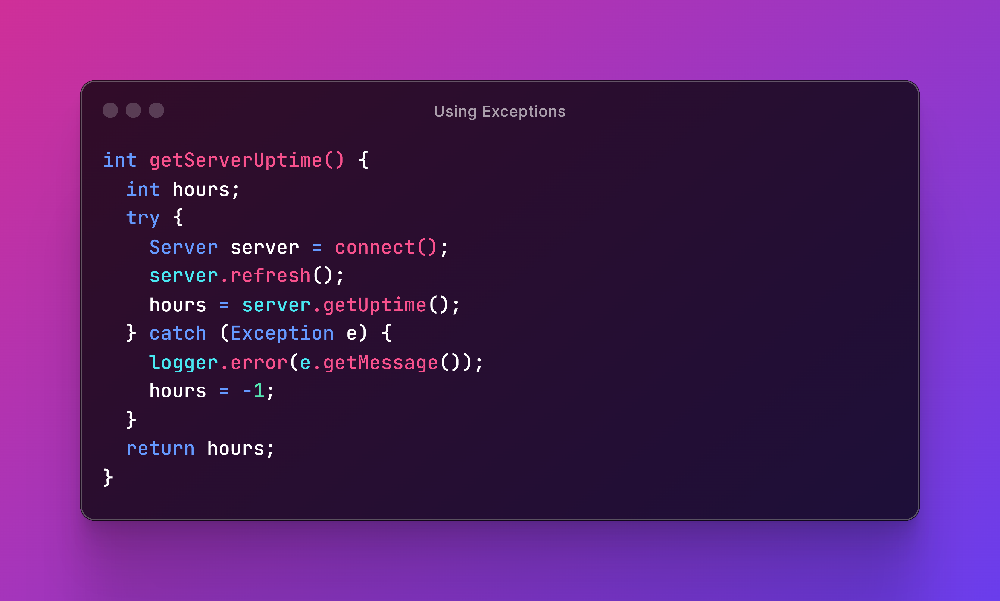
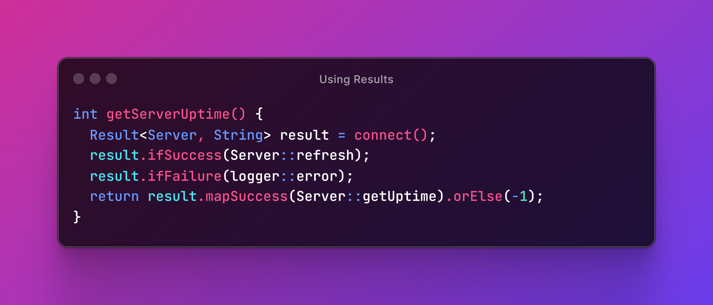
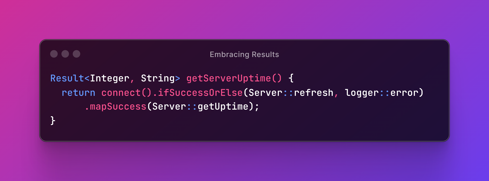

# 🏠 Home

<picture><source srcset=".gitbook/assets/result-logo.dark.svg" media="(prefers-color-scheme: dark)"></picture>

## A library to handle success and failure without exceptions

Wave goodbye to slow exceptions and embrace clean, efficient error handling by encapsulating operations that may succeed or fail in a type-safe way.

<table data-view="cards"><thead><tr><th align="center"></th><th align="center"></th><th align="center"></th></tr></thead><tbody><tr><td align="center"><picture><source srcset=".gitbook/assets/tachometer-alt.dark.svg" media="(prefers-color-scheme: dark)"></picture></td><td align="center"><strong>Boost Performance</strong></td><td align="center">Avoid exception overhead and benefit from faster operations</td></tr><tr><td align="center"><picture><source srcset=".gitbook/assets/tint.dark.svg" media="(prefers-color-scheme: dark)"></picture></td><td align="center"><strong>Simple API</strong></td><td align="center">Leverage a familiar interface for a smooth learning curve</td></tr><tr><td align="center"><picture><source srcset=".gitbook/assets/bolt.dark.svg" media="(prefers-color-scheme: dark)"></picture></td><td align="center"><strong>Streamlined Error Handling</strong></td><td align="center">Handle failure explicitly to simplify error propagation</td></tr><tr><td align="center"><picture><source srcset=".gitbook/assets/shield-alt.dark.svg" media="(prefers-color-scheme: dark)"></picture></td><td align="center"><strong>Safe Execution</strong></td><td align="center">Ensure safer and more predictable operation outcomes</td></tr><tr><td align="center"><picture><source srcset=".gitbook/assets/glasses.dark.svg" media="(prefers-color-scheme: dark)"></picture></td><td align="center"><strong>Enhanced Readability</strong></td><td align="center">Reduce complexity and make your code easier to understand</td></tr><tr><td align="center"><picture><source srcset=".gitbook/assets/filter.dark.svg" media="(prefers-color-scheme: dark)"></picture></td><td align="center"><strong>Functional Style</strong></td><td align="center">Embrace elegant, functional programming paradigms</td></tr><tr><td align="center"><picture><source srcset=".gitbook/assets/mug-hot.dark.svg" media="(prefers-color-scheme: dark)"></picture></td><td align="center"><strong>Pure Java</strong></td><td align="center">Seamless compatibility from JDK8 to the latest versions</td></tr><tr><td align="center"><picture><source srcset=".gitbook/assets/feather-alt.dark.svg" media="(prefers-color-scheme: dark)"></picture></td><td align="center"><strong>Lightweight</strong></td><td align="center">Keep your project slim with no extra dependencies</td></tr><tr><td align="center"><picture><source srcset=".gitbook/assets/balance-scale.dark.svg" media="(prefers-color-scheme: dark)"></picture></td><td align="center"><strong>Open Source</strong></td><td align="center">Enjoy transparent, permissive Apache 2 licensing</td></tr></tbody></table>

### Results in a Nutshell

In Java, methods that can fail typically do so by throwing exceptions. Then, exception-throwing methods are called from inside a `try` block to handle errors in a separate `catch` block.

This approach is lengthy, and that's not the only problem — it's also very slow.


Conventional wisdom says **exceptional logic shouldn't be used for normal program flow**. Results make us deal with expected error situations explicitly to enforce good practices and make our programs [run faster](extra/benchmark.md).


Let's now look at how the above code could be refactored if `connect()` returned a `Result` object instead of throwing an exception.

In the example above, we used only 4 lines of code to replace the 10 that worked for the first one. But we can effortlessly make it shorter by chaining methods. In fact, since we were returning `-1` just to signal that the underlying operation failed, we are better off returning a result object upstream. This will allow us to compose operations on top of `getServerUptime()` just like we did with `connect()`.

Although these examples use `String` as the failure type, results can safely encapsulate whatever type makes the most sense in each situation to represent both success errors.

### Read the Guide

Give it a try and transform your error handling today with Result.


[start](docs/start/)



[basic](docs/basic/)



[advanced](docs/advanced/)

