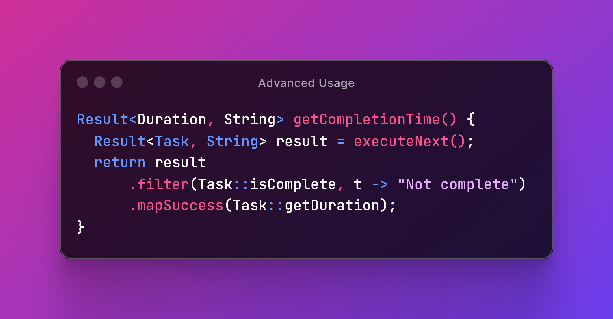

# 🏠 Home


<div data-full-width="true">

<figure><figcaption></figcaption></figure>

</div>

The purpose of this library is to type-safely encapsulate the output of operations that may succeed or fail, instead of throwing exceptions.

| <p><br><strong>Fast</strong><br>Faster than exceptions</p> |      <p><br><strong>Simple</strong><br>No frills, easy to use</p>     | <p><br><strong>Error handling</strong><br>Functional style</p> |
| :----------------------------------------------------------------------------------------------------------------------------------: | :-----------------------------------------------------------------------------------------------------------------------------------: | :----------------------------------------------------------------------------------------------------------------------------: |
|  <p><br><strong>Lightweight</strong><br>Zero dependencies</p> | <p><br><strong>Open Source</strong><br>Apache 2 Licensed</p> |   <p><br><strong>Java Library</strong><br>JDK 8 and up</p>  |


If you like `Optional` but feel that it sometimes falls too short, you will feel right at home.


### Result Library in a Nutshell

Before `Result`, we would wrap the invocation of an exception-throwing method `foo` inside a `try` block so that errors can be handled inside a `catch` block.

```java
public int getFooLength() {
  int length;
  try {
    String result = foo();
    this.ok(result);
    length = result.length();
  } catch(SomeException problem) {
    this.error(problem);
    length = -1;
  }
  return length;
}
```

This approach is lengthy, and that's not the only problem — it's also [very slow](https://dev.leakyabstractions.com/result-benchmark/). Conventional wisdom says exceptional logic shouldn't be used for normal program flow. `Result` makes us deal with expected, non-exceptional error situations explicitly to enforce good programming practices and make our programs run faster.

Let's now look at how the above code could be refactored if `foo` returned a result object instead of throwing an exception:

```java
public int getFooLength() {
  Result<String, SomeFailure> result = foo();
  result.ifSuccessOrElse(this::ok, this::error);
  Result<Integer, SomeFailure> resultLength = result.mapSuccess(String::length);
  return resultLength.orElse(-1);
}
```

In the above example, we use only four lines of code to replace the ten that worked in the first example. But we can make it even shorter by chaining methods in typical functional programming style:

```java
public int getFooLength() {
  return foo().ifSuccessOrElse(this::ok, this::error).mapSuccess(String::length)
    .orElse(-1);
}
```

In fact, since we are using `-1` here just to signal that the underlying operation failed, we'd be better off returning a `Result` object upstream:

```java
public Result<Integer, SomeFailure> getFooLength() {
  return foo().ifSuccessOrElse(this::ok, this::error).mapSuccess(String::length);
}
```

This allows others to easily compose operations on top of ours, just like we did with `foo`.

### Read the Docs


[start](docs/start/)


<figure><figcaption></figcaption></figure>


[basic](docs/basic/)


<figure><figcaption></figcaption></figure>


[advanced](docs/advanced/)


<figure><figcaption></figcaption></figure>
