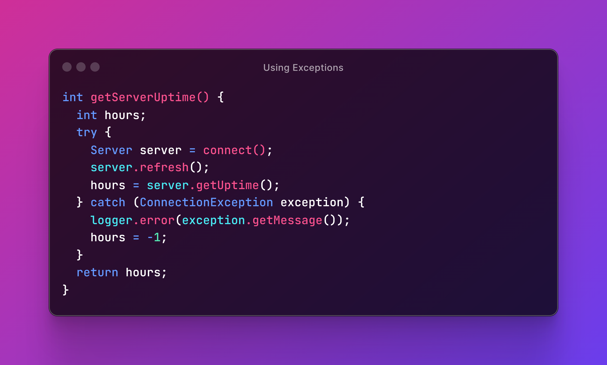

# Home

The purpose of this library is to type-safely encapsulate the output of operations that may succeed or fail, instead of throwing exceptions.

|    **Fast**          High performance |             **Simple**        Very easy to use  |       **Error handling**   Functional style |
| :--------------------------------------------------------------------------------: | :--------------------------------------------------------------------------------: | :----------------------------------------------------------------------------: |
|       **Lightweight**   No dependencies  |    **Open Source**   Apache 2 licensed |    **Java Library**     JDK 8 and up     |

## Results in a Nutshell

In Java, methods that can _fail_ typically do so by _throwing exceptions_. Then, exception-throwing methods are called from inside a `try` block to handle errors in a separate `catch` block.

This approach is lengthy, and that's not the only problem — it's also very slow.


Conventional wisdom says **exceptional logic shouldn't be used for normal program flow**. Results make us deal with _expected error situations_ explicitly to enforce _good practices_ and make our programs [run faster](extra/benchmark.md).


Let's now look at how the above code could be refactored if `connect()` returned a `Result` object instead of throwing an exception.

In the above example, we used only four lines of code to replace the ten that worked for the first one. But we can make it even shorter by chaining methods in functional style. In fact, since we are using `-1` here just to signal that the underlying operation failed, we'd be better off returning a result instance upstream. This allows us to easily compose operations on top of `getServerUptime()` just like we did with `connect()`.

Although this example uses `String` as the failure type, results can use whatever generic type makes the most sense in each situation to represent errors.


If you like `Optional` but feel that it sometimes falls too short, you will feel right at home.


## Read the Docs


[start](docs/start/)



[basic](docs/basic/)



[advanced](docs/advanced/)

