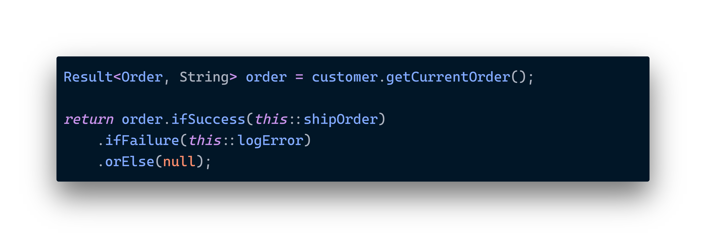

# Basic Usage

Very often, when we have a `Result` instance we want to execute a specific action on the underlying success value. On the other hand, if it’s a failed result we may have some recovery strategy or alternative actions to take.

Other simple scenarios include simply checking whether or not the operation succeeded, and unwrapping the success/failure values.

<figure><figcaption>
You don't need <code>if</code> or early <code>return</code> statements when you can handle success and failure without any hassle.
</figcaption></figure>

