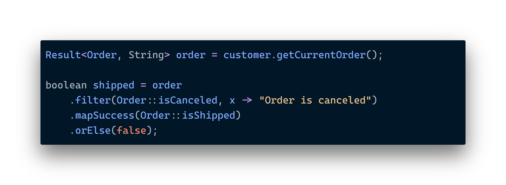

# 🚀 Advanced Usage

While retrieving success/failure values out of `Result` objects can be convenient sometimes, what's in fact more idiomatic is to manipulate the value inside a result without actually unwrapping it. Most of the time, we will apply transformations to result instances, obtaining possibly different result objects in return. This allows us to compose behavior in a [monadic way](https://en.wikipedia.org/wiki/Monad\_\(functional\_programming\)).

<figure><figcaption>
Results can be filtered and transformed just like Java streams.
</figcaption></figure>

