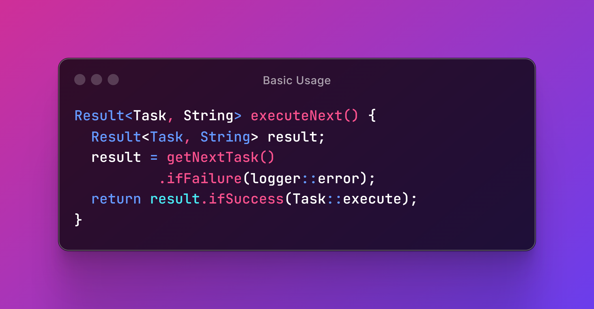

# 🪴 Basic Usage

In this section, we'll cover foundational use cases, including checking the status of a result, unwrapping the value inside a result, and taking different actions based on success or failure. These basics will help you handle errors more cleanly and efficiently without cluttering your code with _try-catch_ blocks.

<figure><figcaption>
You don't need <code>if</code> or early <code>return</code> statements when you can handle success and failure without any hassle.
</figcaption></figure>

