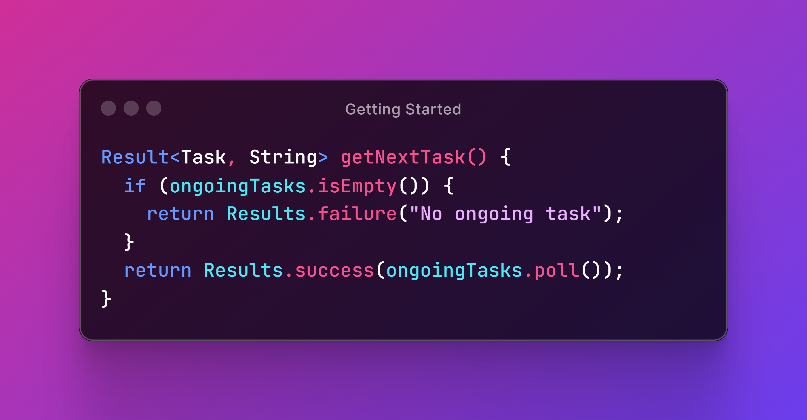

# Getting Started

The purpose of this library is to provide a type-safe encapsulation of operation results that may have succeeded or failed, instead of throwing exceptions.

If you like `Optional` but feel that it sometimes falls too short, you'll love `Result`.

The best way to think of `Result` is as a super-powered version of `Optional`. The only difference is that whereas `Optional` may contain a successful value or express the absence of a value, `Result` contains either a successful value or a failure value that explains what went wrong.

<figure><figcaption>
Don't return <code>null</code> or throw an exception: just return a <em>failed</em> result.
</figcaption></figure>
